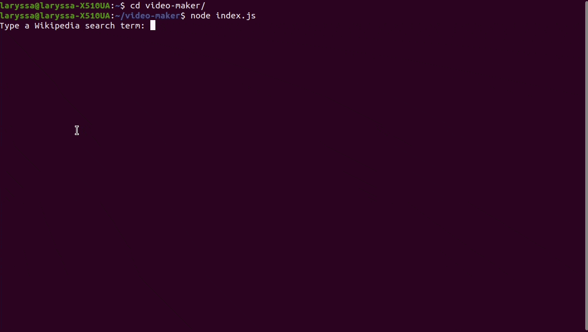

# Video Maker

Este projeto é uma prova de conceito (POC) feita com base na série de vídeos do [Filipe Deschamps](https://github.com/filipedeschamps). O projeto é basicamente um automatizador de vídeos. Consiste em quatro robôs sendo cada um responsável por uma função. O primeiro faz a pesquisa no Wikipedia com o termo de busca informado, o segundo busca as imagens no Google Images e faz o download, o terceiro trata as imagens e renderiza o vídeo e o último, faz o upload do vídeo para o YouTube.

A única diferença em relação ao projeto do Filipe é na parte da renderização do vídeo, já que ele utilizou o After Effects para isso. Neste projeto, utilizei uma solução open source que utiliza FFmpeg e Videoshow (solução apresentada pelo [Antonino Praxedes](https://github.com/apfjunior/video-maker)).

Para a utilização do projeto é necessário as credenciais da API do Algorithmia, do Google Custom Search API, do Watson NLU e do Google OAuth2. No [projeto original](https://github.com/filipedeschamps/video-maker) há mais informações sobre como configurar essas credenciais.

Para a instalação do projeto é necessário o Node.js e as dependências podem ser instaladas executando o seguinte comando na raíz do projeto:

```
npm install
```

Para executar o projeto basta executar o seguinte comando na raíz do projeto:

```
node index.js
```

